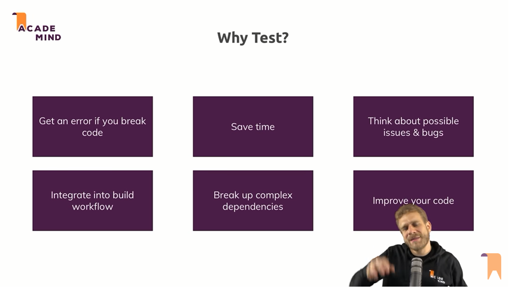

# -- First example to steup & learn javascript unit testing with jest.

- 0- npm install -g npm	//download the latest version of node
- 1- npm init -y   //create package.json file and intialize defualt values into it
- 2- npm i --save-dev jest	//create node_moudules folder
- 3- Change package.json\ test: "jest"
- 4- npm test  // no thing happens
- 5- Create new file has same name like js files (.test) or (.spec) -->    
    "sum.test.js"
- 6- into js file: add export scripts to be imported into another file -->    
    module.exports= function_name 
- 7- into test file: add import script for js file as first line -->   
    const function_name= require('./file_name')
- 8- into test file: add test method with tow parameters, parameter one is for description for what the test is doing, second parameter is a callback function to waht it called to run your test (the expected result happens)    
	test('adds two numbers', () =>{})
- 9- Add the built in function to do the testing (expect somethig to be equal something else) (expect) -->   
	expect(sum(1,2)).toBe(3)      
	expect(sum(1,2)).not.toBe(3)      
	expect(cloneArray(array)).toEqual(array)
- 10- npm test
- 11- What parts of code are tested, which functions and lines get tested:    
	change package.json\ test: "jest --coverage" 
- 12- Move the test files to folder (__test__)
- 13- You sould get result like this :-
<table >
 <tr>
  <td></td>
 </tr>
 </table>

# Some notes about testing :-
    Academind Youtube channel
    https://www.youtube.com/watch?v=r9HdJ8P6GQI&t=1516s

<table >
 <tr>
  <td></td>
  <td></td>
 </tr>
 <tr> 
  <td></td>
  <td></td>
 </tr>
</table>
